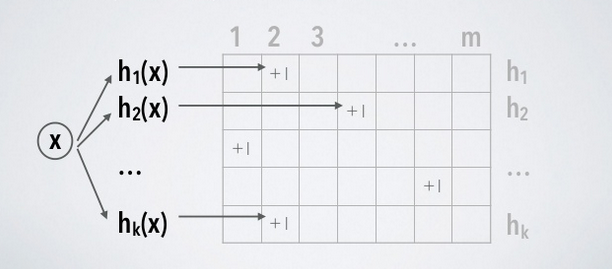
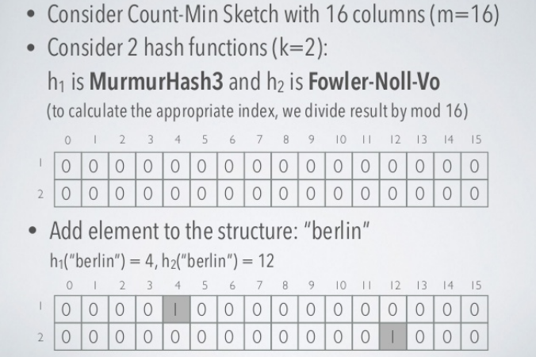
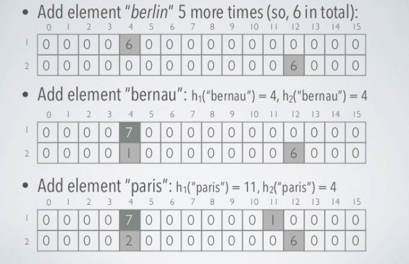
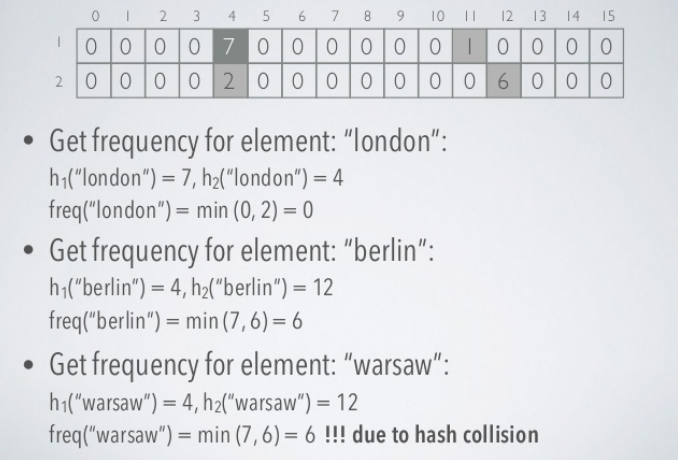
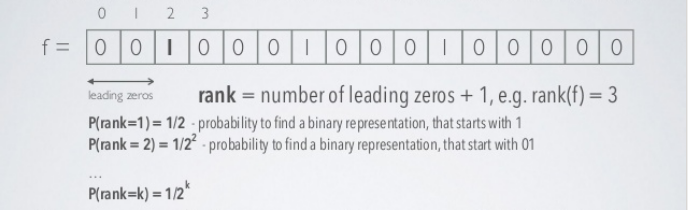
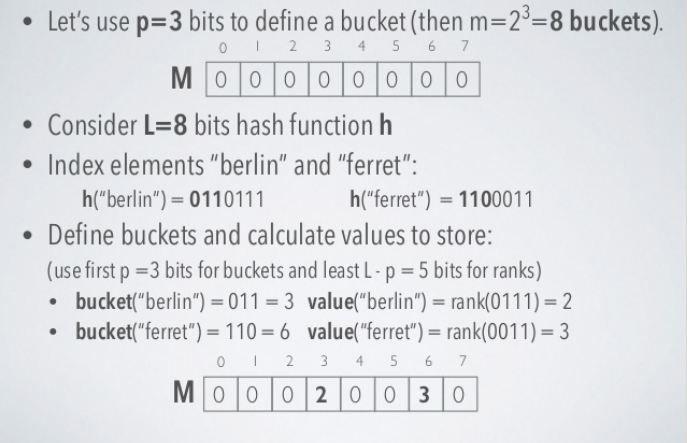
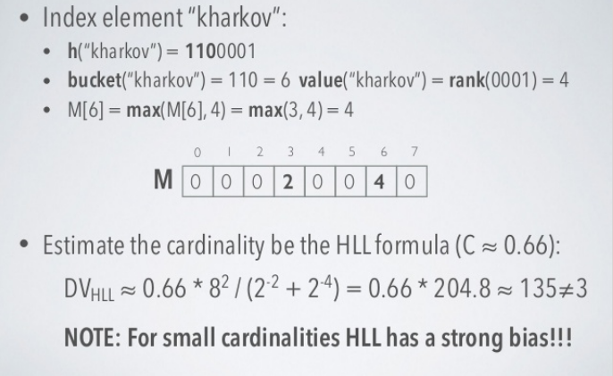
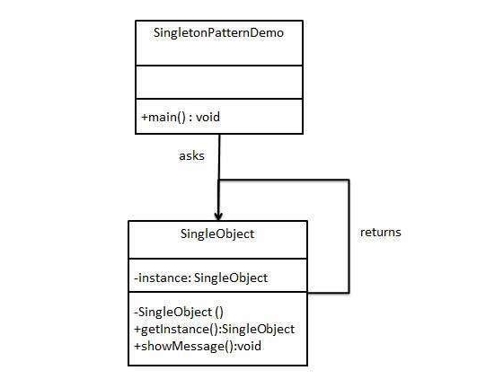

<!-- TOC -->
- [1. Khái niệm](#1-Kh%C3%A1i-ni%E1%BB%87m)
  - [1.1. Cấu trúc dữ liệu](#11-C%E1%BA%A5u-tr%C3%BAc-d%E1%BB%AF-li%E1%BB%87u)
    - [1.1.1. Bloom Filters - Membership](#111-Bloom-Filters---Membership)
    - [1.1.2. Cuckoo filter](#112-Cuckoo-filter)
    - [1.1.3. Count min sketch - Frequency](#113-Count-min-sketch---Frequency)
    - [1.1.4. HyperLogLog - Cardinality](#114-HyperLogLog---Cardinality)
    - [1.1.5. Trie là gì? Ứng dụng như thế nào?](#115-Trie-l%C3%A0-g%C3%AC-%E1%BB%A8ng-d%E1%BB%A5ng-nh%C6%B0-th%E1%BA%BF-n%C3%A0o)
  - [1.2. Design Pattern](#12-Design-Pattern)
    - [1.2.1. Dependency injection](#121-Dependency-injection)
    - [1.2.2. Factory](#122-Factory)
    - [1.2.3. Singleton](#123-Singleton)
    - [1.2.4. Builder](#124-Builder)
    - [1.2.5. Composite](#125-Composite)
  - [1.3. Nguyên tắc lập trình](#13-Nguy%C3%AAn-t%E1%BA%AFc-l%E1%BA%ADp-tr%C3%ACnh)
    - [1.3.1. SOLID](#131-SOLID)
    - [1.3.2. DRY](#132-DRY)
    - [1.3.3. KISS](#133-KISS)
    - [1.3.4. YAGNI](#134-YAGNI)
    - [1.3.5. Do the simplest thing that could possibly work](#135-Do-the-simplest-thing-that-could-possibly-work)
    - [1.3.6. Clean code là gì? Ít nhất 5 cách để clean code?](#136-Clean-code-l%C3%A0-g%C3%AC-%C3%8Dt-nh%E1%BA%A5t-5-c%C3%A1ch-%C4%91%E1%BB%83-clean-code)
- [2. Bài tập](#2-B%C3%A0i-t%E1%BA%ADp)
  - [2.1. Predictive text](#21-Predictive-text)
  - [2.2. Hash Tables](#22-Hash-Tables)
  - [2.3. Tính thời gian xử lý khiếu nại](#23-T%C3%ADnh-th%E1%BB%9Di-gian-x%E1%BB%AD-l%C3%BD-khi%E1%BA%BFu-n%E1%BA%A1i)
- [3. Nguồn tham khảo](#3-Ngu%E1%BB%93n-tham-kh%E1%BA%A3o)
<!-- /TOC -->


# 1. Khái niệm

## 1.1. Cấu trúc dữ liệu

-   `Probabilistic  data structures` không đưa ra kết quả chính xác mà là đưa ra một xấp xĩ gần đúng với câu trả lời hay kết quả của bài toán. Chúng cực kì hữu hiệu đối với big data và streaming application bởi vì có thể giảm thiểu đáng kể dung lượng bộ nhớ cần thiết so với các cấu trúc đưa ra kết quả chính xác
-   Trong phần lớn các cấu trúc dữ liệu này sử dụng hash function làm ngẫu nhiên hóa các items. Điểm mạnh:
    -   Tốn ít bộ nhớ - có thể control được bao nhiêu
    -   Dễ dàng thực hiện song song - hashes độc lập
    -   Có thời gian truy vấn constant - không khấu hao liên tục như trong từ điển

-   Các cấu trúc thường dùng:
    -   Bloom Filters
    -   Cuckoo Filters
    -   Count Min Skectch
    -   HyperLogLog

### 1.1.1. Bloom Filters - Membership

-   Khi insert data mới vào mảng thông thường, giá trị index (nơi data được add vào), không được quyết định bởi giá trị được add vào. Không có mối liên hệ trực tiếp giữa key và value. Do đó, nếu search tìm value phải duyệt tất cả indexs
-   Tuy nhiên với Hash table, ta có thể quyết định key hay index dựa trên hashing cái value. Sau đó đặt value vào đúng index trong danh sách. Điều này có nghĩa key được quyết định bằng value, khi cần tìm value chỉ việc hash value là tìm được index của nó, chỉ tốn O(1) thời gian tìm kiếm


-   Giả sử có một danh sách lớn các mật khẩu yếu và nó được lưu trữ trên một số máy chủ từ xa. Nó không thể tải chúng cùng một lúc trong bộ nhớ / RAM vì kích thước. Mỗi khi người dùng nhập mật khẩu của bạn, bạn muốn kiểm tra xem đó có phải là một trong những mật khẩu yếu hay không và nếu có, bạn muốn đưa ra cảnh báo để thay đổi mật khẩu thành thứ gì đó mạnh hơn. Bạn có thể làm gì? Vì bạn đã có danh sách các mật khẩu yếu, bạn có thể lưu trữ chúng trong bảng băm hoặc một cái gì đó tương tự và mỗi lần bạn muốn khớp, bạn có thể kiểm tra xem mật khẩu đã cho có trùng khớp không. Việc kết hợp có thể nhanh nhưng chi phí tìm kiếm trên đĩa hoặc qua mạng trên máy chủ từ xa sẽ làm cho nó chậm. Đừng quên rằng bạn sẽ cần phải làm điều đó cho mọi mật khẩu được cung cấp bởi mọi người dùng. Làm thế nào chúng ta có thể giảm chi phí?

-   Bloom filter có thể kiểm tra xem 1 giá trị nào đó `có thể ` nằm trong tập hợp hoặc `chắc chắn` không nằm trong tập hợp
-   Bloom filter bao gồm vector các bit có độ dài m, khởi tạo ban đầu là các bit 0
  


-   Khi add một item vào bloom filter, ta đưa nó vào k hàm hash khác nhau, ra được kết quả và set bit 1 vào các vị trí đó. Trong hash table ta chỉ dùng 1 hàm hash và chỉ lấy được 1 index duy nhất. Nhưng với Bloom filter có nhiều hàm hash và nhiều indexes


-   Ví dụ, với geeks ở trên, cho vào 3 hàm hash cho 3 giá trị là 1, 4, 7


-   Với input là nerd vào 3 hàm hash cho gía trị 3, 4, 5. Ta thấy index 4 đã đánh dấu trước đó bởi geeks


-   Bây giờ cần tìm kiếm từ "cat" ta vẫn thực hiện hash với 3 functions bình thường và được 1, 3, 7. Ta nhận thấy tất cả index đều đã được mark là 1. Ta có thể kết luận: "cat" có thể nằm trong list. Nhưng thực tế cat không nằm trong list, điều này khẳng định tính xác suất của Bloom filters
-   Nếu ta tìm kiếm và nhận thấy 1 trong các index bằng 0 thì chắc chắn value đó không nằm trong list
-   Nếu tất cả index đều bằng 1 thì có thể value nằm trong list
-   Bây giờ, quay lại ví dụ ‘mật khẩu mà chúng ta đã nói trước đó. Nếu chúng ta triển khai kiểm tra mật khẩu yếu với Bloom filter, có thể thấy rằng ban đầu, chúng ta sẽ đánh dấu Bloom filter của mình bằng danh sách mật khẩu, sẽ cung cấp cho chúng a một vectơ bit với một số chỉ mục được đánh dấu là '1' và các chỉ số khác còn lại là 0. Vì kích thước của Bloom filter sẽ không lớn và sẽ có kích thước cố định, nó có thể dễ dàng được lưu trữ trong bộ nhớ và cả ở phía máy khách nếu cần. Đó là tại sao Bloom filter rất hiệu quả về mặt không gian. Khi một bảng băm yêu cầu có kích thước tùy ý dựa trên input data, Bloom filter có thể hoạt động tốt với kích thước cố định
-   Vì vậy, mỗi khi người dùng nhập mật khẩu của họ, chúng ta sẽ cung cấp mật khẩu cho các hàm băm và kiểm tra mật khẩu dựa trên vectơ bit. Nếu mật khẩu đủ mạnh, Bloom filter sẽ cho chúng ta thấy rằng mật khẩu chắc chắn không có trong danh sách mật khẩu yếu không thực hiện thêm bất kỳ truy vấn nào. Nhưng nếu mật khẩu có vẻ yếu và mang lại kết quả "maybe yếu" thì sẽ gửi nó đến máy chủ và kiểm tra danh sách thực tế  để xác nhận


-   Bloom filter cơ bản hỗ trợ 2 phương thức chủ yếu là: test và add
-   Test kiểm tra xem phần tử có nằm trong list hay không
-   Add thêm phần tử mới vào list
-   Bloom filter nếu remove phần tử thông thường sẽ gây nên tình trạng false negative, tức là kết luận phần tử không nằm trong list nhưng lại sai
-   Nếu muốn dùng remove phải sử dụng Counting bloom filter. Thay vì lưu single bit của value, chúng ta sẽ lưu integer của value và bit vector sẽ trở thành integer vector. Khi đó thay vì set bit là 1 thì sẽ là tăng 1 đơn vị, kiểm tra thì xét > 0   
-   Bloom filter size và hash function:
    -   Nếu kích thước Bloom filter quá nhỏ thì tất cả các bit có thể bật 1 hết sau đó sẽ bị false positive cho tất cả input. Một filter lớn sẽ ít bị false positive hơn. Ta có thể điều chỉnh Bloom filter với độ chính xác chúng ta cần dựa trên false positive error rate
    -   Cần dùng bao nhiêu hash function? Càng nhiều thì càng nhanh đầy Bloom filter và càng chậm, quá ít hash function thì dễ bị false positve


-   Tăng số lượng hàm hash k, xác suất false positive giảm
-   Công thức tính xác suất false positive p dựa trên size filter m, số lượng hàm hash k và số phần tử được inserted n:

 

-   Ta cần xác định m và k, cần xác định xác suất sai số p trước và số phần tử n ta có thể tìm được m và k theo công thức:


### 1.1.2. Cuckoo filter

-   Cuckoo filter cải thiện thiết kế của Bloom filter bằng việc đề xuất delete, giới hạn counting, xác suất false positive được giới hạn trong khi vẫn giữ được giống space complexity. Sử dụng Cuckoo để giải quyết đụng độ và bản chất là một bản băm cuckoo compact


-   Thực hiện:
    -   Cuckoo filter bao gồm bảng băm Cuckoo lưu trữ `fingerprints`của các items được chèn. Fingerprints của một item là một chuỗi bit có nguồn gốc từ hàm băm của items đó. Bảng băm cuckoo bao gồm một mảng các buckets trong đó một mục được chèn được ánh xạ tới hai nhóm có thể dựa trên hai hàm băm. Mỗi buckets có thể được cấu hình để lưu trữ một số lượng fingerprints khác nhau. Thông thường, Cuckoo filter được xác định bằng kích thước fingerprints và buckets của nó. Ví dụ: Cuckoo filter (2,4) lưu trữ fingerprints dài 2 bit và mỗi bucket trong bảng băm Cuckoo có thể lưu trữ tối đa 4 fingerprints.

-   Insertion:

    ```python
    f = fingerprint(x);
    i1 = hash(x);
    i2 = i1 ⊕ hash(f);

    if bucket[i1] or bucket[i2] has an empty entry then
    add f to that bucket;
    return Done;

    // must relocate existing items;
    i = randomly pick i1 or i2;
    for n = 0; n < MaxNumKicks; n++ do
    randomly select an entry e from bucket[i];
    swap f and the fingerprint stored in entry e;
    i = i ⊕ hash(f);
    if bucket[i] has an empty entry then
        add f to bucket[i];
        return Done;

    // Hashtable is considered full;
    return Failure;
    ```

-   Search:

    ```python
    f = fingerprint(x);
    i1 = hash(x);
    i2 = i1 ⊕ hash(f);

    if bucket[i1] or bucket[i2] has f then
        return True;

    return False;
    ```

-   Delete:

    ```python
    f = fingerprint(x);
    i1 = hash(x);
    i2 = i1 ⊕ hash(f);

    if bucket[i1] or bucket[i2] has f then
    remove a copy of f from this bucket;
    return True;

    return False;
    ```

-   Space complexity:
    -   Liên quan đến các bộ lọc cuckoo và bloom filter, chúng thực hiện khác nhau ở các xác suất false positive khác nhau. Khi xác suất false positive của bộ lọc nhỏ hơn hoặc bằng 3%, bộ lọc cuckoo có ít bit hơn cho mỗi mục nhập. Khi cao hơn, bộ lọc bloom filter có ít bit hơn cho mỗi mục nhập

-   Time complexity:
    -   Trong băm cuckoo, chèn một phần tử có vẻ tệ hơn nhiều so với O (1) trong trường hợp xấu nhất vì có thể có nhiều trường hợp trong khi va chạm, trong đó chúng ta phải xóa một giá trị để nhường chỗ cho giá trị hiện tại. Thêm vào đó, nếu có một chu kỳ thì toàn bộ bảng phải được thử lại

### 1.1.3. Count min sketch - Frequency
-   Dùng để ước lượng số lần xuất hiện của 1 phần tử trong tập hợp
-   Là cấu trúc dữ liệu có không gian sublinear mà hỗ trợ:
    -   add phần tử vào cấu trúc
    -   count số lần đó phần tử được thêm vào
-   Được diễn tả bởi 2 thông số:
    -   m - số lượng các buckets (độc lập với n và nhỏ hơn)
    -   k - số lượng các hàm hash khác nhau (nhỏ hơn nhiều so với m)

-   Yêu cầu kích thước không gian cố định: m*k counters và k hash function
-   Đơn giản đó là một ma trận các biến đếm (khởi tạo 0)



-   Khi add phần tử vào sketch - tính toán tất cả k hàm hash và tăng biến đếm theo vị trí [i, hi(element)], i = 1 .. k
-   Bởi vì soft collisions, chúng ta có k ước lượng của tần số thực sự của phần tử bởi vì chúng ta không bao giờ giảm biến đếm nên chỉ có thể bị trường hợp overestimate
-   Để get tần số, ta tính tất cả k hàm hash và lấy giá trị nhỏ nhất của biến đếm trong vị trí [i, hi(element)]. i = 1 .. k
-   Thời gian cần để add và trả về tần số là hằng số O(k), giả định rằng các hash function có thể được đánh giá với constant time

    





-   Tính chất của Count min sketch:

    -   Chỉ trả về tần số lớn hơn hoặc bằng thực tế
    -   Để đạt được một xác suất sai số p, ta cần k >= ln(1/p)
        -   Với p khoảng 1% thì k = 5 khá hợp lí
    -   Count min sketch chủ yếu giống cấu trúc dữ liệu Bloom filter    
    -   Sự khác biệt ở cách sử dụng:
        -   Count min sketch có số ô gần như tuyến tính, phụ thuộc đến chất lượng xấp xỉ của sketch
        -   Bloom filter có số ô trùng với số lượng phần tử trong tập hợp

-   Ứng dụng:
    -   AT&T sử dụng Count Min Sketch trong chuyển đổi các mạng để thực hiện đánh giá các traffic network sử dụng memory giới hạn
    -   Ở Google sử dụng tiền thân của nó để thực hiện MapReduce kiến trúc xử lí song song

### 1.1.4. HyperLogLog - Cardinality

-   Không gian phân biệt (Cardinality) của các tập hợp các số được phân bố thống nhất có thể được ước lượng bởi tối đa số 0 ở đầu trong biểu diễn nhị phân của mỗi số. Nếu giá trị value là k, số lượng các phần tử phân biệt trong tập hợp là 2^k



-   Đối với 2^k biểu diễn nhị phân, chúng  ta sẽ  tìm được ít nhất 1 đại diện với rank = k
-   Nếu ta tìm được rank lớn nhất có thể và nó bằng k, 2^k  là ước lượng xấp xỉ số phần tử 

-   Hyperloglog được biểu diễn bởi 2 thông số:
    -   p - số bits (xác định một bucket để dùng average), m = 2^p là số bucket 
    -   h - hash function, produces ra uniform hash values

-   Hyperloglog có thể ước lượng không gian phân biệt > 10^9 với độ lệch chuẩn 2%, sử dụng 1.5 kB bộ nhớ
-   Hyperloglog sử dụng việc ngẫu nhiên hóa để xấp xĩ cardinality của một multiset, việc random này dựa trên hàm hash
-   Quan sát số lượng bit 0 ở đầu lớn nhất đối với tất cả các giá trị hash
    -   Nếu mẫu bit 0(L-1)1 được quan sát bắt đầu của một giá trị hash (rank = L), nên ước lượng hợp lý kích thước tập là 2^L

-   Stochastic average (trung bình ngẫu nhiên) được dùng để giảm bớt sự đa dạng quá lớn:
    -   Input stream của data các phần tử S được chia thành m stream con Si sử dụng p bits đầu của giá trị hash (m = 2^p)
    -   Trong mỗi stream con, rank được đo một cách độc lập
    -   Các số này được lưu trong mảng các register M, M[i] lưu trữ maximum rank có thể có đối với stream con tại vị trí index i

-   Cardinality estimation được tính toán như normalized bias corrected harmonic mean của các ước lượng trên các stream con

-   Ví dụ
  
    

    

-   Yêu cầu cho không gian bộ nhớ không grow theo tuyến tính với L, đối với các hàm hash L bits và precision p: 

-   Đối với Hyperloglog sử dụng 32 bit hash code, yêu cầu 5.2^p bits

-   Không cần phải tính toàn bộ full hash code cho phần tử :
    -   p bits đầu và số số 0 đầu tiên của các bit còn lại là đủ

-   Tính chất Hyperloglog: 
    -   Thuật toán sai số lớn đối với không gian nhỏ
    -   

-   Ứng dụng:
    -   PFCOUNT trong Redis sử dụng HyperLogLog sử dụng 12kb per key để đếm với sai số 0.81%, không có giới hạn số lượng trừ phi tiếp cận 2^64 items

### 1.1.5. Trie là gì? Ứng dụng như thế nào?
- Trie là một cấu trúc dữ liệu dùng để quản lý một tập hợp các xâu. Trie cho phép:

  - Thêm một xâu vào tập hợp
  - Xóa một xâu khỏi tập hợp
  - Kiểm tra một xâu có tồn tại trong tập hợp hay không.

**Cấu trúc**

- Trie gồm một gốc không chứa thông tin, trên mỗi cạnh lưu một ký tự, mỗi nút và đường đi từ gốc đến nút đó thể hiện 1 xâu, gồm các ký tự là các ký tự thuộc cạnh trên đường đi đó.


- Trong hình vẽ trên, nút 1 là nút gốc, nút 7 thể hiện có 1 xâu là ‘bg’, nút 8 thể hiện có 1 xâu là ‘db’, nút 9 thể hiện có 1 xâu là ‘dc’, nút 10 thể hiện có 1 xâu là ‘acd’, nút 5 thể hiện là có 1 xâu là ‘ab’.

- Đối với một số nút, chẳng hạn nút 4, ta không biết nó là thể hiện kết thúc 1 xâu hay chỉ là 1 phần của đường đi từ nút 1 đến nút 9. Vì vậy, khi cài đặt, thông thường, tại nút U ta cần lưu thêm thông tin nút U có là kết thúc của 1 xâu hay không, hoặc nút U là kết thúc của bao nhiêu xâu, tuỳ theo yêu cầu bài toán.

**Ưu điểm**

- Cài đặt đơn giản, dễ nhớ

- Tiết kiệm bộ nhớ: Khi số lượng khóa lớn và các khóa có độ dài nhỏ, thông thường trie tiết kiệm bộ nhớ hơn do các phần đầu giống nhau của các khoá chỉ được lưu 1 lần. Ưu điểm này có ứng dụng rất lớn, chẳng hạn trong từ điển.

- Thao tác tìm kiếm: O(m) với m là độ dài khóa. Với Binary search tree (cân bằng): là O(logN). Khi số lượng khóa cần tìm lớn và độ dài mỗi khóa tương đối nhỏ, logN xấp xỉ m, để cài được Binary search tree cân bằng không phải là một việc đơn giản. Hơn nữa, các thao tác trên trie rất đơn giản và thường chạy nhanh hơn trên thực tế.

- Dựa vào tính chất của cây trie, có thể thực hiện một số liên quan đến thứ tự từ điển như sắp xếp, tìm một khóa có thứ tự từ điển nhỏ nhất và lớn hơn một khóa cho trước, và một số thao tác liên quan đến tiền tố, hậu tố.

**Cài đặt**


```java
    // Alphabet size (# of symbols) 
    static final int ALPHABET_SIZE = 26; 
      
    // trie node 
    static class TrieNode 
    { 
        TrieNode[] children = new TrieNode[ALPHABET_SIZE]; 
       
        // isEndOfWord is true if the node represents 
        // end of a word 
        boolean isEndOfWord; 
          
        TrieNode(){ 
            isEndOfWord = false; 
            for (int i = 0; i < ALPHABET_SIZE; i++) 
                children[i] = null; 
        } 
    }; 
       
    static TrieNode root;  
      
    // If not present, inserts key into trie 
    // If the key is prefix of trie node,  
    // just marks leaf node 
    static void insert(String key) 
    { 
        int level; 
        int length = key.length(); 
        int index; 
       
        TrieNode pCrawl = root; 
       
        for (level = 0; level < length; level++) 
        { 
            index = key.charAt(level) - 'a'; 
            if (pCrawl.children[index] == null) 
                pCrawl.children[index] = new TrieNode(); 
       
            pCrawl = pCrawl.children[index]; 
        } 
       
        // mark last node as leaf 
        pCrawl.isEndOfWord = true; 
    } 
       
    // Returns true if key presents in trie, else false 
    static boolean search(String key) 
    { 
        int level; 
        int length = key.length(); 
        int index; 
        TrieNode pCrawl = root; 
       
        for (level = 0; level < length; level++) 
        { 
            index = key.charAt(level) - 'a'; 
       
            if (pCrawl.children[index] == null) 
                return false; 
       
            pCrawl = pCrawl.children[index]; 
        } 
       
        return (pCrawl != null && pCrawl.isEndOfWord); 
    } 
       
    // Driver 
    public static void main(String args[]) 
    { 
        // Input keys (use only 'a' through 'z' and lower case) 
        String keys[] = {"the", "a", "there", "answer", "any", 
                         "by", "bye", "their"}; 
       
        String output[] = {"Not present in trie", "Present in trie"}; 
       
       
        root = new TrieNode(); 
       
        // Construct trie 
        int i; 
        for (i = 0; i < keys.length ; i++) 
            insert(keys[i]); 
       
        // Search for different keys 
        if(search("the") == true) 
            System.out.println("the --- " + output[1]); 
        else System.out.println("the --- " + output[0]); 
          
        if(search("these") == true) 
            System.out.println("these --- " + output[1]); 
        else System.out.println("these --- " + output[0]); 
          
        if(search("their") == true) 
            System.out.println("their --- " + output[1]); 
        else System.out.println("their --- " + output[0]); 
          
        if(search("thaw") == true) 
            System.out.println("thaw --- " + output[1]); 
        else System.out.println("thaw --- " + output[0]); 
         
    } 

```

**Output**

```
the --- Present in trie
these --- Not present in trie
their --- Present in trie
thaw --- Not present in trie
```

## 1.2. Design Pattern

### 1.2.1. Dependency injection


- Dependency Inversion: Đây là một nguyên lý để thiết kế và viết code.
- Inversion of Control: Đây là một design pattern được tạo ra để code có thể tuân thủ nguyên lý Dependency Inversion. Có nhiều cách hiện thực pattern này: ServiceLocator, Event, Delegate, … Dependency Injection là một trong các cách đó.
- Dependency Injection: Đây là một cách để hiện thực Inversion of Control Pattern (Có thể coi nó là một design pattern riêng cũng được). Các module phụ thuộc (dependency) sẽ được inject vào module cấp cao.

- Có thể hiểu Dependency Injection một cách đơn giản như sau:
  - Các module không giao tiếp trực tiếp với nhau, mà thông qua interface. Module cấp thấp sẽ implement interface, module cấp cao sẽ gọi module cấp thấp thông qua interface. 
    - Ví dụ: Để giao tiếp với database, ta có interface IDatabase, các module cấp thấp là XMLDatabase, SQLDatabase. Module cấp cao là CustomerBusiness sẽ chỉ sử dụng interface IDatabase.
  - Việc khởi tạo các module cấp thấp sẽ do DI Container thực hiện
    - Ví dụ: Trong module CustomerBusiness, ta sẽ không khởi tạo IDatabase db = new XMLDatabase(), việc này sẽ do DI Container thực hiện. Module CustomerBusiness sẽ không biết gì về module XMLDatabase hay SQLDatabase.
  - Việc Module nào gắn với interface nào sẽ được config trong code hoặc trong file XML.
  - DI được dùng để làm giảm sự phụ thuộc giữa các module, dễ dàng hơn trong việc thay đổi module, bảo trì code và testing.

Có 3 dạng Dependency Injection:
- **Constructor Injection**: Các dependency sẽ được container truyền vào (inject vào) 1 class thông qua constructor của class đó. Đây là cách thông dụng nhất.
- **Setter Injection**: Các dependency sẽ được truyền vào 1 class thông qua các hàm Setter.
- **Interface Injection**: Class cần inject sẽ implement 1 interface. Interface này chứa 1 hàm tên Inject. Container sẽ injection dependency vào 1 class thông qua việc gọi hàm Inject của interface đó. Đây là cách rườm rà và ít được sử dụng nhất.

Ưu điểm:
- Giảm sự kết dính giữa các module
- Code dễ bảo trì, dễ thay thế module
- Rất dễ test và viết Unit Test
- Dễ dàng thấy quan hệ giữa các module (Vì các dependecy đều được inject vào constructor)

Khuyết điểm:
- Khái niệm DI khá “khó tiêu”, các developer mới sẽ gặp khó khăn khi học
- Sử dụng interface nên đôi khi sẽ khó debug, do không biết chính xác module nào được gọi
- Các object được khởi tạo toàn bộ ngay từ đầu, có thể làm giảm performance
- Làm tăng độ phức tạp của code

Cài đặt:

- Ví dụ chúng ta có một class Car, trong đó có chứa một vài object khác như Wheel, Battery...


```java
class Car{
  private Wheels wheel = new MRFWheels();
  private Battery battery = new ExcideBattery();
  ...
  ...
}
```

- Ở đây, class Car chịu trách nhiệm khởi tạo tất cả các dependency object. Nhưng chuyện gì sẽ xảy ra nếu chúng ta muốn bỏ MRFWheel và thay thế bằng YokohamaWheel.

- Chúng ta sẽ cần tạo một class Car mới với YokohamaWheel, tuy nhiên khi sử dụng dependency injection, chúng ta có thể đổi Wheel ở runtime vì dependency có thể đc đẩy vào (inject) ở runtime thay vì complile time.

- Bạn có thể hiểu là dependency injection là một người trung gian chịu trách nhiệm tạo ra các loại wheel khác nhau, rồi cung cấp chúng cho class Car. Việc đó làm cho class Car ko phải phụ thuộc vào Wheel cụ thể nào hay Battery cụ thể nào nữa.

```java
class Car{
  private Wheels wheel;
  private Battery battery;
  
  /*Ở đâu đó trong project, ta khởi tạo những objects mà đc yêu cầu bởi class này
    Có 2 cách để implement dependency injection
    1. Dựa vào constructor
    2. Dựa vào Setter method
  */
  
  // Dựa vào constructor
  Car(Wheel wh, Battery bt) {
    this.wh = wh;
    this.bt = bt;
  }
  
  // Dựa vào Setter method
  void setWheel(Batter bt){
    this.bt = bt;
  }
  ...  
  ...
}
```

Vậy trách nhiệm của dependency injection là:

- Tạo ra các object.
- Biết được class nào cần những object đấy.
- Cung cấp cho những class đó những object chúng cần.

Bằng cách này, nếu trong tương lai object đó có sự thay đổi thì dependency injection có nhiệm vụ cấp lại những object cần thiết cho class.

### 1.2.2. Factory

- Mẫu thiế kế Factory Method cho phép các lớp con chọn kiểu đối tượng cần tạo.
- Nó thúc đẩy sự liên kết lỏng lẻo bằng cách loại bỏ sự cần thiết phải ràng buộc các lớp cụ thể vào code. Điều đó có nghĩa là code chỉ tương tác với interface hoặc lớp abstract, để nó sẽ làm việc với bất kỳ lớp nào implements interface đó hoặc extends lớp abstract.

Khi nào sử dụng mẫu thiết kế Factory Method:

- Khi một lớp không biết những lớp con nào sẽ được yêu cầu để tạo ra.
- Khi một lớp muốn các lớp con của nó chỉ định các đối tượng được tạo ra.
- Khi các lớp cha chọn việc tạo các đối tượng cho các lớp con của nó.

Ví dụ:

- Chúng ta sẽ tạo ra một lớp trừu tượng Plan và các lớp cụ thể được extends lớp trừu tượng Plan. Tiếp theo định nghĩa một lớp nhà máy có tên GetPlanFactory.
- Lớp GenerateBill sẽ sử dụng GetPlanFactory để lấy đối tượng Plan. Nó sẽ chuyển thông tin (DOMESTICPLAN / COMMERCIALPLAN / INSTITUTIONALPLAN) tới GetPalnFactory để có được loại đối tượng cần thiết.


Step 1: Tạo lớp trừu tượng Plan. 

```java
public abstract class Plan {
    protected double rate;
 
    abstract void getRate();
 
    public void calculateBill(int units) {
        System.out.println(units * rate);
    }
}
```

Step 2: Tạo các lớp cụ thể extends lớp trừu tượng Plan. 

```java
public class DomesticPlan extends Plan {
    @Override
    public void getRate() {
        rate = 3.50;
    }
}
```

```java
public class CommercialPlan extends Plan {
    @Override
    public void getRate() {
        rate = 7.50;
    }
}
```

```java
public class CommercialPlan extends Plan {
    @Override
    public void getRate() {
        rate = 7.50;
    }
}
```

```java
public class InstitutionalPlan extends Plan {
    @Override
    public void getRate() {
        rate = 5.50;
    }
}
```

Step 3: Tạo lớp nhà máy GetPlanFactory để sinh ra các đối tượng của các lớp cụ thể dựa trên thông tin đã cho. 

```java
public class GetPlanFactory {
    // sung dung phuong thuc getPlan de lay doi tuong co kieu Plan
    public Plan getPlan(String planType) {
        if (planType == null) {
            return null;
        }
        if (planType.equalsIgnoreCase("DOMESTICPLAN")) {
            return new DomesticPlan();
        } else if (planType.equalsIgnoreCase("COMMERCIALPLAN")) {
            return new CommercialPlan();
        } else if (planType.equalsIgnoreCase("INSTITUTIONALPLAN")) {
            return new InstitutionalPlan();
        }
        return null;
    }
}
```

Step 4: Sinh ra hóa đơn bằng cách sử dụng GetPlanFactory để lấy đối tượng của lớp cụ thể bằng cách truyền thông tin như sau DOMESTICPLAN hoặc COMMERCIALPLAN hoặc INSTITUTIONALPLAN. 

```java
public class GenerateBill {
    public static void main(String args[]) throws IOException {
        GetPlanFactory planFactory = new GetPlanFactory();
 
        System.out.print("Nhap ten cua plan de tao hoa don: ");
        BufferedReader br = new BufferedReader(new InputStreamReader(System.in));
 
        String planName = br.readLine();
        System.out.print("Nhap so luong don vi cho hoa don: ");
        int unit = Integer.parseInt(br.readLine());
 
        Plan p = planFactory.getPlan(planName);
 
        System.out.print("Hoa don " + planName + " cua  " + unit + " don vi la: ");
        p.getRate();
        p.calculateBill(unit);
    }
}
```

Output:

```
Nhap ten cua plan de tao hoa don: DOMESTICPLAN
Nhap so luong don vi cho hoa don: 20
Hoa don DOMESTICPLAN cua  20 don vi la: 70.0
```


### 1.2.3. Singleton

- Singleton Pattern là một mẫu thiết kế (design pattern) được sử dụng để bảo đảm rằng mỗi một lớp (class) chỉ có được một thể hiện (instance) duy nhất và mọi tương tác đều thông qua thể hiện này.

- Singleton Pattern cung cấp một phương thức khởi tạo private, duy trì một thuộc tính tĩnh để tham chiếu đến một thể hiện của lớp Singleton này. Nó cung cấp thêm một phương thức tĩnh trả về thuộc tính tĩnh này.

Bài toán thực tế
- Bạn gặp một sự cố về hiệu năng hệ thống. Cùng một thời điểm, các bạn đang sử dụng một lúc nhiều đối tượng và chúng làm tiêu tốn quá nhiều tài nguyên của hệ thống. Đây là vấn đề mà bạn cần phải khắc phục, và Singleton pattern có thể giúp bạn thực hiện được điều đó.

- Mẫu duy nhất Singleton chắc chắn rằng bạn có thể khởi tạo chỉ duy nhất một đối tượng cho một lớp. Nếu bạn không sử dụng mẫu thiết kế này, toán tử new như thường sử dụng, sẽ tạo ra liên tiếp nhiều đối tượng mới

- Bạn sử dụng mẫu Singleton khi bạn muốn hạn chế việc sử dụng tài nguyên hoặc khi bạn phải xử lý 1 đối tượng nhạy cảm mà dữ liệu của nó không thể chia sẻ cho mọi thể hiện.
- Bất cứ khi nào bạn thật sự cần duy nhất 1 thể hiện của 1 lớp, hãy nghĩ tới mẫu Singleton thay vì dùng toán tử new.

Cài đặt



```java
class Singleton {

    private static Singleton instance;

    private Singleton() {
    }

    public static Singleton getInstance() {
        if (instance == null) {
            instance = new Singleton();
        }
        return instance;
    }
}

public class ClassSingleton {

    public static void main(String[] args) {
        System.out.println("--- Singleton Pattern ---");
        Singleton single1 = Singleton.getInstance();
        Singleton single2 = Singleton.getInstance();
        if (single1.equals(single2)) {
            System.out.println("Unique Instance");
        }
    }
}
```

### 1.2.4. Builder
- Builder pattern là một mẫu thiết kế thuộc "Nhóm khởi tạo" (Creational Pattern). Mẫu thiết kế này cho phép lập trình viên tạo ra những đối tượng phức tạp nhưng chỉ cần thông qua các câu lệnh đơn giản để tác động nên các thuộc tính của nó. 

- Một lập trình viên muốn sử dụng Builder pattern khi:
  - Anh ấy muốn thay đổi thiết kế cho việc lồng nhau của các hàm khởi tạo (Telescoping Constructor Pattern). Vấn đề này phát sinh khi lập trình viên làm việc với một lớp mà có chứa rất nhiều các thuộc tính và cần phải tạo ra nhiều hàm khởi tạo với số lượng các thuộc tính tăng dần.
  - Anh ấy cần tạo ra một đối tượng phức tạp, một đối tượng mà thuật toán để tạo tạo lập các thuộc tính là độc lập đối với các thuộc tính khác.

Cài đặt


Xét một trường hợp kinh doanh của nhà hàng thức ăn nhanh trong đó một bữa ăn điển hình có thể là burger và cold drink. Burger có thể là Veg Burger hoặc Chicken Burger và sẽ được đóng gói bởi một gói. Đồ uống lạnh có thể là coke hoặc pepsi và sẽ được đóng gói trong chai.

Chúng tôi sẽ tạo ra một interface Item đại diện cho các mặt hàng thực phẩm như burger và cold drink và các concrete class thực hiện interface Item và và interface Packing đại diện cho việc đóng gói các mặt hàng thực phẩm và các class concrete thực hiện interface Packing vì burger sẽ được đóng gói trong Wrapprt và cold drinks sẽ được đóng gói trong bottle.

Sau đó, chúng ta tạo một lớp Meal có ArrayList of Item và MealBuilder để xây dựng các loại đối tượng Meal khác nhau bằng cách kết hợp Item. BuilderPotypeDemo, lớp demo ta sẽ sử dụng MealBuilder để xây dựng Meal.

Step 1

- Create an interface Item representing food item and packing.
- Item.java

```java
public interface Item {
   public String name();
   public Packing packing();
   public float price();	
}
```
- Packing.java

```java
public interface Packing {
   public String pack();
}
```

Step 2
- Create concrete classes implementing the Packing interface.
- Wrapper.java

```java
public class Wrapper implements Packing {

   @Override
   public String pack() {
      return "Wrapper";
   }
}
```

- Bottle.java

```java
public class Bottle implements Packing {

   @Override
   public String pack() {
      return "Bottle";
   }
}
```


Step 3

- Create abstract classes implementing the item interface providing default functionalities.

- Burger.java

```java
public abstract class Burger implements Item {

   @Override
   public Packing packing() {
      return new Wrapper();
   }

   @Override
   public abstract float price();
}
```

- ColdDrink.java

```java
public abstract class ColdDrink implements Item {

	@Override
	public Packing packing() {
       return new Bottle();
	}

	@Override
	public abstract float price();
}
```

Step 4

- Create concrete classes extending Burger and ColdDrink classes

- VegBurger.java

```java
public class VegBurger extends Burger {

   @Override
   public float price() {
      return 25.0f;
   }

   @Override
   public String name() {
      return "Veg Burger";
   }
}
```

- ChickenBurger.java

```java
public class ChickenBurger extends Burger {

   @Override
   public float price() {
      return 50.5f;
   }

   @Override
   public String name() {
      return "Chicken Burger";
   }
}
```

- Coke.java

```java
public class Coke extends ColdDrink {

   @Override
   public float price() {
      return 30.0f;
   }

   @Override
   public String name() {
      return "Coke";
   }
}
```

- Pepsi.java

```java
public class Pepsi extends ColdDrink {

   @Override
   public float price() {
      return 35.0f;
   }

   @Override
   public String name() {
      return "Pepsi";
   }
}
```

Step 5

- Create a Meal class having Item objects defined above.

- Meal.java

```java
import java.util.ArrayList;
import java.util.List;

public class Meal {
   private List<Item> items = new ArrayList<Item>();	

   public void addItem(Item item){
      items.add(item);
   }

   public float getCost(){
      float cost = 0.0f;
      
      for (Item item : items) {
         cost += item.price();
      }		
      return cost;
   }

   public void showItems(){
   
      for (Item item : items) {
         System.out.print("Item : " + item.name());
         System.out.print(", Packing : " + item.packing().pack());
         System.out.println(", Price : " + item.price());
      }		
   }	
}
```

Step 6

- Create a MealBuilder class, the actual builder class responsible to create Meal objects.

- MealBuilder.java

```java
public class MealBuilder {

   public Meal prepareVegMeal (){
      Meal meal = new Meal();
      meal.addItem(new VegBurger());
      meal.addItem(new Coke());
      return meal;
   }   

   public Meal prepareNonVegMeal (){
      Meal meal = new Meal();
      meal.addItem(new ChickenBurger());
      meal.addItem(new Pepsi());
      return meal;
   }
}
```

Step 7

- BuiderPatternDemo uses MealBuider to demonstrate builder pattern.

- BuilderPatternDemo.java

```java
public class BuilderPatternDemo {
   public static void main(String[] args) {
   
      MealBuilder mealBuilder = new MealBuilder();

      Meal vegMeal = mealBuilder.prepareVegMeal();
      System.out.println("Veg Meal");
      vegMeal.showItems();
      System.out.println("Total Cost: " + vegMeal.getCost());

      Meal nonVegMeal = mealBuilder.prepareNonVegMeal();
      System.out.println("\n\nNon-Veg Meal");
      nonVegMeal.showItems();
      System.out.println("Total Cost: " + nonVegMeal.getCost());
   }
}
```

Step 8

- Verify the output.

```
Veg Meal
Item : Veg Burger, Packing : Wrapper, Price : 25.0
Item : Coke, Packing : Bottle, Price : 30.0
Total Cost: 55.0

Non-Veg Meal
Item : Chicken Burger, Packing : Wrapper, Price : 50.5
Item : Pepsi, Packing : Bottle, Price : 35.0
Total Cost: 85.5
```


### 1.2.5. Composite

- Composite Pattern là một mẫu cấu trúc (Structural Pattern).

- Composite Pattern cho phép tương tác với tất cả các đối tượng tương tự nhau giống như là các đối tượng đơn hoặc collections.

- Ví dụ: Đối tượng File sẽ là 1 đối tượng đơn nếu bên trong nó không có file nào khác, nhưng đối tượng file sẽ được đối xử giống như 1 collections nếu bên trong nó lại có những File khác.

- Khi tính kích thước của File ta sẽ cần tính kích thước của tất cả các file bên trong nó.

UML Diagrams


- **Component** (Thành phần):

    - Khai báo interface hoặc abstract chung cho các thành phần đối tượng.
    Chứa các method thao tác chung của các thành phần đối tượng.

- **Leaf** (Lá):

  - Biểu diễn các đối tượng lá (ko có con) trong thành phần đối tượng.

- **Composite** (Hỗn hợp):

  - Định nghĩa một thao tác cho các thành phần có thành phần con.
    Lưu trữ thành phần con.
    Thực thi sự quản lý các thành phần con của giao diện Component.

Ví dụ

- 1 project là 1 tập hợp nhiều tác vụ (Task) con, đồng thời bản thân project cũng là 1 task lớn.

- Ta cần tính tống thời gian của project thông qua thời gian của các task con.


- Tại TaskItem.java

```java
    public abstract class TaskItem {
        public abstract double getTime();
    }
```

- Tại Task.java

```java
    public class Task extends TaskItem {
      String name;
      double time;
      public Task() {
      }
      public Task(String name, double time) {
        this.name = name;
        this.time = time;
      }
      public String getName() {
        return name;
      }
      public void setName(String name) {
        this.name = name;
      }
      @Override
      public double getTime() {
        return time;
      }
      public void setTime(double time) {
        this.time = time;
      }
    }
```

- Tại Project.java

```java
    public class Project extends TaskItem {
        
        String name;
        ArrayList<TaskItem> subTask = new ArrayList<>();
        
        public Project() {
        }
        
        public Project(String name, ArrayList<TaskItem> subTask) {
            this.name = name;
            this.subTask = subTask;
        }
        
        public String getName() {
            return name;
        }
        
        public void setName(String name) {
            this.name = name;
        }
        
        public ArrayList<TaskItem> getSubTask() {
            return subTask;
        }
        
        public void setSubTask(ArrayList<TaskItem> subTask) {
            this.subTask = subTask;
        }
        
        @Override
        public double getTime() {
            double time = 0;
            for (int i = 0; i < subTask.size(); i++) {
                time += subTask.get(i).getTime();
            }
            return time;
        }
        
        public void addTask(TaskItem taskItem) {
            if (subTask.contains(taskItem) == false) {
                subTask.add(taskItem);
            }
        }
        public void removeTask(TaskItem taskItem) {
            subTask.remove(taskItem);
        }
    }
```

- Demo

```java
    public class MainApp {
      public static void main(String[] args) {
        Task task1 = new Task("requirement", 50);
        Task task2 = new Task("analysis", 34);
        Task task3 = new Task("design", 65);
        Task task4 = new Task("implement", 23);
        Task task5 = new Task("test", 65);
        Task task6 = new Task("maintain", 32);
        ArrayList<TaskItem> subTask = new ArrayList<>();
        subTask.add(task1);
        subTask.add(task2);
        subTask.add(task3);
        subTask.add(task4);
        subTask.add(task5);
        subTask.add(task6);
        Project project = new Project("quan li diem", subTask);
        // tinh tong thoi gian du an
        System.out.println("total time: " +project.getTime());
        // tinh tong thoi gian du an sau khi bo task: maintain
        project.removeTask(task6);
        System.out.println("total time after remove maintain task: " +project.getTime());
      }
    }
```

- Kết quả:

```
total time: 269.0
total time after remove maintain task: 237.0
```


## 1.3. Nguyên tắc lập trình

### 1.3.1. SOLID

- Tập hợp những nguyên tắc trong lập trình hướng đối tượng. Các chữ cái đầu hợp lại thành SOLID.

- **SRP (Single Responsibility Principle)** – “Một class chỉ được có 1 nhiệm vụ” hay nói cách khác, “nếu muốn chỉnh sửa class thì chỉ được phép có 1 và chỉ 1 lý do”.

- **OCP (Open/closed principle)** – “Mở class khi cần mở rộng nó, đóng class khi cần chỉnh sửa nó”.

- **LSP (Liskov substitution principle)** – “Subtype phải luôn có thể được thay thế bằng supertype”.

- **ISP (Interface segregation principle)** – “Việc dùng nhiều interface cho các client khác nhau, tốt hơn là việc chỉ dùng 1 interface cho cùng lúc nhiều mục đích” hay nói cách khác “Không được phép hạn chế access vào những method mà client không sử dụng”.

- **DIP (Dependency inversion principle)** – “Module tầng trên không được phụ thuộc vào module tầng dưới. Bất cứ module nào cũng phải phụ thuộc vào cái trừu tượng, không phải vào cái cụ thể”.

### 1.3.2. DRY

- Viết tắt của “Don’t repeat yourself” – với ý nghĩa là “Đừng lặp lại những gì giống nhau”.

- Khi nguyên tắc này được áp dụng tốt, dù ta có thay đổi 1 phần thì những phần không liên quan cũng sẽ không bị thay đổi theo. Hơn nữa, những phần có liên quan sẽ được thay đổi cùng 1 lượt, giúp ích rất nhiều cho cả khâu estimate và khâu thực hiện.

### 1.3.3. KISS

- Viết tắt của “Keep it simple, stupid” – “Cứ đơn giản thôi, đồ ngu!”. Đây là 1 triết lí của Hải quân Mỹ.

-  "Keep it simple, silly", "keep it short and simple", "keep it simple and straightforward", "keep it small and simple", or "keep it stupid simple"

### 1.3.4. YAGNI

- Viết tắt của “You ain’t gonna need it” – Cái (chức năng, phần) ấy rồi sẽ không cần thiết.

- Đó là một câu khẩu ngữ nhắc nhở người lập trình rằng trong quy trình Extreme Programming (lập trình cực hạn) thì : “Chưa phải lúc cần thiết thì chưa được phép làm.”

### 1.3.5. Do the simplest thing that could possibly work


- Phần mềm có thể phức tạp và dễ dàng khiến các đội cảm thấy choáng ngợp. Để làm dịu mọi thứ và giúp giải quyết sự phức tạp quá mức, một trong những câu thần chú của XP là làm điều đơn giản nhất có thể có thể làm việc.

- Đối với các lập trình viên, điều đó có thể có nghĩa là bắt đầu với một bài kiểm tra đơn vị đơn giản và chỉ thêm độ phức tạp bổ sung khi nó đang hoạt động.

- Đối với thiết kế có thể có nghĩa là bắt đầu với một cái gì đó đơn giản đến nực cười, và thêm sự phức tạp chỉ trong thời gian, nếu câu chuyện tiếp theo đảm bảo nó.

- Giá trị của sự đơn giản là giữ cho mọi thứ đơn giản nhất có thể và lấy đi bất cứ thứ gì không thiết yếu mà không làm tăng thêm giá trị.

>    There are two ways of constructing a software design: One way is to make it so simple that there are obviously no deficiencies, and the other way is to make it so complicated that there are no obvious deficiencies. The first method is far more difficult.
    C. A. R. Hoare

### 1.3.6. Clean code là gì? Ít nhất 5 cách để clean code?

- Có nhiều định nghĩa về clean code, tùy mỗi người mỗi cách nhìn khác nhau:
  - `Clean code does one thing well.` (Bjarne Stroustrup)
  - `Clean code is simple and direct, clean code read like well-written prose.` (Grady Booch)
  - `Clean code can be read, clean code should be literate. It has meaningful names` (Dave Thomas)
  - `Clean code always looks like it was written by someone who cares.` (Micheal Feathers)
  - `Reduced duplication, high expressiveness, and early building of simple abstractions.` (Ron Jeffries)
  - `You know you are working on clean code when each routine you reads turns out to be pretty much what you expected.` (Ward Cunningham)

- Đối với tôi, clean code là code sao cho rõ ràng người đọc dễ hiểu, dễ debug, dễ bảo trì, nâng cấp

- Các cách để Clean code:
  - Sử dụng meaningful names: tên tiết lộ ý định, tên dễ đọc, tên dễ tìm kiếm 
  - Member prefixes: tránh các ký tự gạch dưới khi đặt tên biến, nên chọn convention rồi follow
  - Hungarian: nên tránh thêm kiểu dữ liệu vào sau tên biến
  - Class name: tên class không nên là động từ, phải là danh từ:
    - Thêm cái nữa là giả sử từ Address. Thấy hay có cái như AccountAddress ClientAddress MACAddress. Nó khá dư thừa.

    - Tốt hơn nên sử dụng luôn MAC thay cho MACAdress. Còn ClientAddress hay AccountAddress thì nên là Client.Address thay cho Client.ClientAddress

    - Trong trường hợp cùng một class mà có 2 property liên quan đến address như Client.HouseAddress và Client.CompanyAddress thì nên dùng

  - Method name: nên là động từ 
  - Functions: một hàm nên có tầm 20 dòng, 150 kí tự là đẹp, 1 method nên làm đúng 1 việc mà tên hàm đưa ra
  - Comments nên hạn chế được đưa vào code, tuy nhiên dưới đây là một số good comment bạn nên đưa vào để bổ sung các thông tin hữu ích cho các đoạn code của bạn:
    - Legal Comments: Comment về pháp lý
    
    ```c
    /**
    * Created by VSCode.
    * User: Le Thanh Cong
    * Date: 04/07/2019
    * Time: 08:50
    */
    ```

    - Các comment chứa thông tin: cung cấp thông tin cơ bản nhất về 1 hàm (đầu vào, format đầu ra)
    - Giả thích thêm cho mục đích, quyết định
    - Đưa ra cảnh báo hậu quả
    - TODO comments: các công việc chưa kịp thực hiện hoặc cần phát triển
    - Hạn chế các comments thừa, code comments
  - Sử dụng Exceptions hơn là trả về giá trị trong code:
    
    ```php
    public function updateBook($id, $attribute)
    {
        $boook = Book::find($id);
        if (!empty($book)) {
            $book->update($attribute);
        } else {
            throw new Exception('404');
        }
    }
    ```

  -   Đừng trả về null, thay vào đó hãy trả về SPECIAL CASE OBJECT
  -   Viết các đoạn code thành Try-Catch-Finally để dễ quan sát các xử lý code và ngoại lệ
  -   Cung cấp đầy đủ thông tin ngoại lệ nhất (có thể ghi log) để dễ dàng debug
  -   Nếu exception có code logic hoặc các exception gây ra bởi bên thứ 3, cân nhắc "wrapping"- đóng gói lại trong một lớp ngoại lệ mới ta xây dựng
  -   Chưa có cách hoàn hảo nhất để xử lý với null, hạn chế truyền và nhận nó vào các hàm


-   Khi sử dụng switch-case, cân nhắc sử dụng ABSTRACT FACTORY.
    
    ```java
    public abstract class Employee {
        public abstract boolean isPayday();
        public abstract Money calculatePay();
        public abstract void deliverPay(Money pay);
    }
    -----------------
    public interface EmployeeFactory {
        public Employee makeEmployee(EmployeeRecord r) throws InvalidEmployeeType;
    }
    -----------------
    public class EmployeeFactoryImpl implements EmployeeFactory {
        public Employee makeEmployee(EmployeeRecord r) throws InvalidEmployeeType {
            switch (r.type) {
            case COMMISSIONED:
            return new CommissionedEmployee(r) ;
            case HOURLY:
            return new HourlyEmployee(r);
            case SALARIED:
            return new SalariedEmploye(r);
            default:
            throw new InvalidEmployeeType(r.type);
            }
        }
    }
    ```

- Cân nhắc và tìm cách giảm đối số truyền vào của 1 hàm, xuống 1 đến 2 là tốt để có thể test và dễ hiểu.
- Tên hàm cũng cực kì quan trọng, tránh để double-take. Tên đẹp nhất là cum verb/noun(cho loại hàm 1 đối số).
# 2. Bài tập

## 2.1. Predictive text

Cho dataset [Blog Authorship Corpus](https://github.com/niderhoff/nlp-datasets).

Làm chương trình Java cung cấp 2 tính năng:

- Kiểm tra 1 từ có nằm trong dataset không? 
- Gợi ý những từ giống với từ **input** mà có trong dataset (gần giống như cách Google instant search gợi ý). Sự gần giống giữa các từ do em tự định nghĩa nhưng phải hợp lý.

**Yêu cầu**:

- Phải hiện thực ít nhất `2 cách` với tính năng kiểm tra từ tồn tại.
- Tìm cách tối ưu chương trình với các cấu trúc dữ liệu mà em đã học được ở trên.
- `Benchmark` cho phần kiểm tra từ.
- Sử dụng ít nhất `2 design pattern`.
- `Không được import lib` có sẵn(được `copy source` hiện thực nhưng sẽ có hỏi về cách hoạt động).
- Phần gợi ý phải gợi ý `ít nhất 5` từ gần giống với input đầu vào.
- Tự định nghĩa cách hiện `output`.
- Nhớ viết chương trình như một `Good Programmer`

**Tip**: Nên định nghĩa 1 interface là `Dictionary` với method `public boolean contains(String word)` để implement lại.

[Solution](exercise/predictiveText/src/main/java/com/cong/predictiveText)

**Hướng giải quyết:**
-   Định hướng các thao tác cần xử lý:
    -   Đọc file
    -   Xử lí dữ liệu, chuẩn hóa các từ
    -   Xây dựng class để kiểm tra tồn tại từ trong văn bản
    -   Duyệt và thêm các từ vào cấu trúc class đã xây dựng
    -   Xây dựng GUI cho phép nhập, gợi ý và kiểm tra xem từ nhập vào có tồn tại hay không?
-   Đọc file và xử lí chuỗi: 
    -   Xây dụng class DataReader có nhiệm vụ đọc tất cả các file trong 1 thư mục, đọc từng dòng và lưu vào string, kết hợp với class DataNormalizer cắt chuỗi, chuẩn hóa và lưu từng từ vào Set<String>, duyệt các từ trong Set<String> add vào class Bloom Filter và class Trie, đây là 2 class tìm kiếm từ sẽ đề cập sau
-  Với tính năng kiểm tra từ tồn tại:
   -  Ta lựa chọn Trie và Bloom Filter, một cách chính xác hoàn toàn và một cách có tỉ lệ false positive nhất định. 
   -  2 class này kế thừa class Dictionary
   -  Sử dụng 2 mẫu thiết kế là Dependency Injection và Singleton. Mẫu Dependency injection áp dụng với class DictionaryList khi cho phép set chọn loại kiểm tra từ tồn tại là BloomFilter hoặc Trie. Mẫu Singleton chỉ cho phép mỗi class BloomFilter và Trie chỉ có duy nhất 1 thể hiện
- Xây dựng GUI:
  - Sử dụng thư viện mặc định Swing của Java tạo GUI đơn giản
    
    

  -   Có khung nhập input với JTextField, gợi ý với JList, JComboBox cho phép chọn loại kiểm tra tồn tại và JButton để bắt sự kiện search
- Output và predictive text:
  - Output in ra xem từ đó có tồn tại không, bởi thuật toán nào và thời gian chạy bao nhiêu
  - Predictive text: là tập hợp các từ sau khi thực hiện DFS trên Trie sau đó hiển thị lên JList

## 2.2. Hash Tables

- Tham khảo [repo sau](https://github.com/jamesroutley/write-a-hash-table).
- Viết lại hoàn toàn bằng Java một hash table tương tự.
- Hiện thực ít nhất 3 cách giải quyết đụng độ.

[Solution](exercise/hashTable/src/main/java/com/cong)

**Hướng giải quyết:**

-   Xây dựng class HashTable và class HashTableItem, HashTable sẽ chứa 1 arraylist HashTableItem
-   Xử lí đụng độ: **Separate chaining** và **Open addressing**. Ở đây ta sử dụng **Open addressing**, địa chỉ mở nhằm mục đích giải quyết sự không hiệu quả không gian của **Separate chaining**. Khi đụng độ xảy ra, item đụng độ được đặt trong một số bucket khác trong bảng. Bucket mà item được đặt vào được chọn theo một số quy tắc được xác định trước, có thể được lặp lại khi tìm kiếm item. Có ba phương pháp phổ biến để chọn bucket để chèn item đụng độ vào:
  
    -   **Linear probing**:
        -   Khi đụng độ xảy ra, index tăng và item được đặt vào bucket kế bên trong array
        -   Insert: hash key để tìm bucket index. Nếu bucket trống, đặt item vào, nếu đụng độ, lặp lại tăng index cho đến khi gặp bucket trống
        -   Search: hash key để tìm bucket, lặp lại việc tăng index, so sánh key, cho đến khi tìm được bucket trống hoặc matching key thì dừng, trả về giá trị không thì trả về null
        -   Delete: hash key để tìm bucket index, lặp lại việc tăng index, so key để tìm key xóa, nếu gặp key matching thì xóa nó.
        -   Linear probing offers good [cache performance](https://en.wikipedia.org/wiki/Locality_of_reference), nhưng lại gặp vấn đề về clustering issues. Khi đặt các item đụng độ dẫn đến các bucket chứa các item kéo dài liên tục, khi search, insert, delete phải lặp nhiều lần để tìm key
  
    -   **Quadratic probing**:
        -   Giống với Linear probing nhưng thay vì đặt item đụng độ vào kế bên, ta đặt theo qui luật sau: `i, i + 1, i + 4, i + 9, i + 16, ...` với i là original hash của key
        -   Insert, Search, Delete tương tự Linear probing
        -   Quadratic probing giảm thiểu việc clustering mà vẫn cung cấp cache performance tốt
  
    -  **Double hashing**:
       -  Mục đích chính là giải quyết clustering.
       -  Sử dụng một hàm hash nữa để chọn index mới cho item
       -  Sử dụng hàm hash cho chúng ta một bucket mới, index này nên phân bổ đều các bucket
       -  Giải quyết được clustering nhưng cũng mất đi cache performance khỏi locality of reference.
       -  Đây là cách thông dụng trong quản lý đụng độ trong hash table thông dụng

-   Xử lí resize lại kích thước HashTable:
    -   HashTable ban đầu có kích thước cố định các buckets, càng nhiều item được add vào thì bảng càng đầy dẫn đến vấn đề sau:
        -   Hiệu năng giảm do tỉ lệ đụng độ cao
        -   Kích thước cố định nên nếu ta add thêm quá nhiều sẽ không được nữa 
    -  Chúng ta có thể lưu kích thước item array khi bảng dần đầy. Ta tính tỉ lệ filled buckets/total buckets. Sau đó resize theo tỉ lệ sau:
       -  up nếu tỉ lệ > 0.7
       -  down nếu tỉ lệ < 0.1
    -  Để resize, ta tạo HashTable với kích thước bằng một nửa hoặc gấp đôi hiện tại sau đó insert tất cả items chưa delete vào bảng đó
    -  Kích thước array mới nên là 1 số nguyên tố hoặc nửa size hiện tại. Chúng ta lưu trước base size, khi size up, tăng gấp đôi base size, và tìm số nguyên tố lớn hơn gần nhất, khi size down, giảm 1 nữa và tìm số nguyên tố lớn hơn gần nhất

## 2.3. Tính thời gian xử lý khiếu nại

Hiện tại, bộ phần CS(Customer Service) sẽ nhận các khiếu nại từ người dùng và trả lời các khiếu nại đó. Để người dùng không phải chờ câu trả lời quá lâu, chúng ta phải đảm bảo người dùng sẽ nhận câu trả lời trong thời gian tối đa là 8 tiếng làm việc. Vì vậy, cần một chương trình tính `thời gian từ lúc nhận khiếu nại đến khi khiếu nại được giải quyết` để biết bộ phận CS làm việc có hiệu quả.

Giờ làm việc được tính từ `8h30` tới `12h` với buổi sáng và `13h30` đến `18h` với buổi chiều. CS sẽ làm nguyên ngày từ thứ 2 đến thứ 6, riêng thứ 7 sẽ chỉ làm buổi sáng.

Trong folder `ticketSLA` là 1 project java đã được `init` sẵn. Bạn hãy hiện thực hàm `calculate` ở class `SlaServiceImpl`. Sau đó, các bạn thêm testcase trong `SlaServiceTest` để kiểm tra tính đúng sai của hàm đã viết.

`Lưu ý`:

- Đây là 1 bài toán thực tế nên không có bất kì giới hạn nào.
- Nếu có bất kì thắc mắc nào, vui lòng liên hệ `thinhda`.
- `Benchmark` cho hàm `calculate`.

[Solution](exercise/ticketSLA/src)

**Hướng giải quyết**:

-   Xây dựng một abstract class đại điện cho các kiểu thời gian nghỉ (ngoài giờ làm việc), kèm theo là các lớp kế thừa cụ thể cho mỗi trường hợp:

    

-   Ở mỗi class concrete TimeOffAtNoon, TimeOffAtNight, TimeOffAtWeekend, ta cài đặt hàm getNum để lấy được số lần nghỉ như vậy giữa 2 khoảng thời gian, getDurationToMinus có nhiệm vụ nhân số lần nghỉ ở getNum với thời gian nghỉ 1 lần tương ứng với mỗi loại thời gian nghỉ. Sau này nếu có thay đổi ta chỉ việc thêm các class con kết thừa TimeOffType
-   Class WorkingTime có nhiệm vụ add các TimeOffType và lấy khoảng thời gian giữa bắt đầu nộp đơn và kết thúc nộp đơn trừ cho tất cả các loại TimeOffType ta được thời gian Working của team CS
-   Demo:

    

# 3. Nguồn tham khảo
- [Principles of Good Programming](https://www.artima.com/weblogs/viewpost.jsp?thread=331531)
- [Programming Principles](https://github.com/webpro/programming-principles#avoid-premature-optimization)
- [Clean code](https://gitlab.zalopay.vn/zalopay-freshers/onboarding/tree/master/books/tech/skills)
- [Series 4 bài về Probabilistic data structures của Andrii Gakhov](https://www.slideshare.net/gakhov/presentations).
- [One secret to becoming a great software engineer: read code](https://hackernoon.com/one-secret-to-becoming-a-great-software-engineer-read-code-467e31f243b0?zdlink=Uo9XRcHoRsba8ZeYOszjBcrbP6brRIvoPM5aPN8YB29fRtCYEdiYSsDePMrbNtLoR28w8dfXR6yjE38uCZKsCZCsEbmlN2yYB29XS71fP28w8ZWoE38rDZ8pDY9zVG)
- [Awesome Algo](https://github.com/tayllan/awesome-algorithms).
- [Cracking the Coding Interview: 150 Programming Questions and Solutions](https://www.amazon.com/Cracking-Coding-Interview-Programming-Questions/dp/098478280X).
- [Data Structures and Algorithms in Java (2nd Edition)](https://www.amazon.com/Data-Structures-Algorithms-Java-2nd/dp/0672324539).
- [jupyter](jupyter.md)

-   https://highlyscalable.wordpress.com/2012/05/01/probabilistic-structures-web-analytics-data-mining/
-   https://blog.vietnamlab.vn/2016/09/29/gioi-thieu-ve-bloom-filter/
-   https://hackernoon.com/probabilistic-data-structures-bloom-filter-5374112a7832

-   https://medium.com/techlog/cuckoo-filter-vs-bloom-filter-from-a-gophers-perspective-94d5e6c53299

- https://vnoi.info/wiki/algo/data-structures/trie

- https://viblo.asia/p/tim-hieu-singleton-pattern-MVpeKPAOkKd

- https://viblo.asia/p/design-patterns-singleton-pattern-maGK7zra5j2

- https://stackjava.com/design-pattern/composite-pattern.html

-   https://viblo.asia/p/clean-code-chapter-7-error-handling-aWj53OvG56m